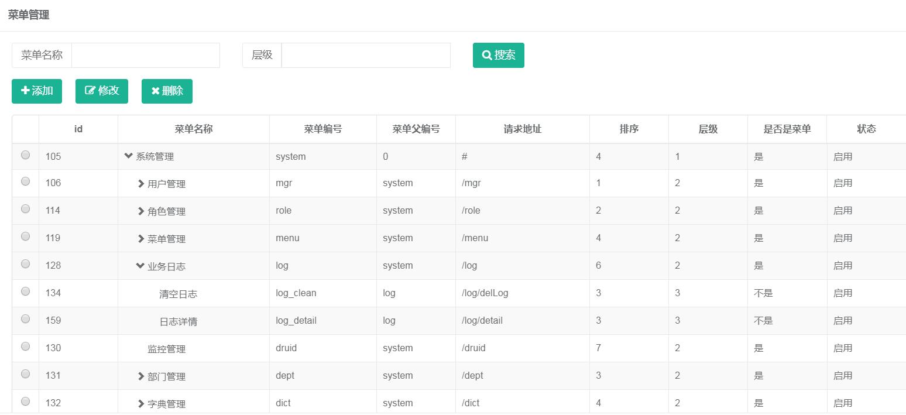
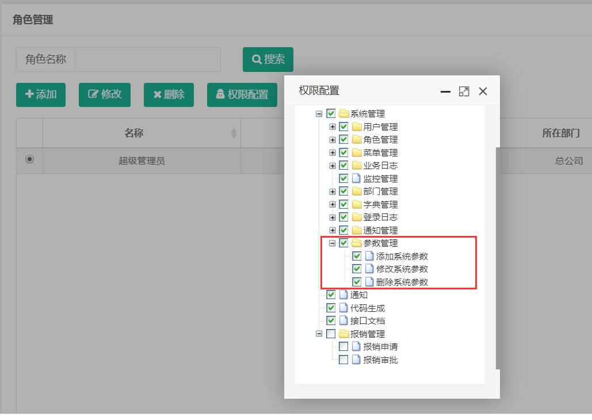
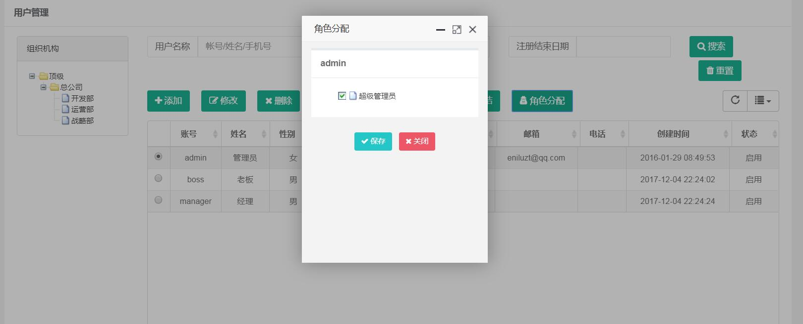

# 权限管理
本节介绍系统权限管理内容，权限管理分为以下及部分：
- 权限配置
- 权限控制


## 权限配置
权限管理的核心为控制角色对菜单的访问，所以权限配置主要包含以下内容的维护：

- 菜单管理： 维护要控制的页面菜单和按钮


- 角色管理： 为角色配置可以访问的菜单和按钮



- 用户管理： 为用户配置角色




## 权限控制

权限控制包含内容较多，本节从几方面说明
- Shiro的过滤器链
- 左侧菜单导航的权限控制
- 页面功能的权限控制
- 后台权限控制

 ## Shiro的过滤器链
 
 cn.enilu.guns.admin.config.web.ShiroConfig 中配置系统登录url，登录成功url，以及拦截器链，参考代码
 
 ```java
 @Bean
    public ShiroFilterFactoryBean shiroFilter(DefaultWebSecurityManager securityManager) {
        ShiroFilterFactoryBean shiroFilter = new ShiroFilterFactoryBean();
        shiroFilter.setSecurityManager(securityManager);
        /**
         * 默认的登陆访问url
         */
        shiroFilter.setLoginUrl("/login");
        /**
         * 登陆成功后跳转的url
         */
        shiroFilter.setSuccessUrl("/");
        /**
         * 没有权限跳转的url
         */
        shiroFilter.setUnauthorizedUrl("/global/error");
        /**
         * 配置shiro拦截器链
         *
         * anon  不需要认证
         * authc 需要认证
         * user  验证通过或RememberMe登录的都可以
         *
         * 当应用开启了rememberMe时,用户下次访问时可以是一个user,但不会是authc,因为authc是需要重新认证的
         *
         * 顺序从上到下,优先级依次降低
         *
         */
        Map<String, String> hashMap = new LinkedHashMap<>();
        hashMap.put("/static/**", "anon");
        hashMap.put("/login", "anon");
        hashMap.put("/global/sessionError", "anon");
        hashMap.put("/kaptcha", "anon");
        hashMap.put("/**", "user");
        shiroFilter.setFilterChainDefinitionMap(hashMap);
        return shiroFilter;
    }
```

## 左侧菜单导航的权限控制

登录成功后根据当前用户角色查询所有菜单，生成左侧菜单树：

```java
List<Integer> roleList = ShiroKit.getUser().getRoleList();
List<MenuNode> menuNodes =  menuService.getMenusByRoleIds(roleList);
List<MenuNode> titles = MenuNode.buildTitle(menuNodes);
titles = ApiMenuFilter.build(titles);

model.addAttribute("titles", titles);
```

页面生成菜单树:

```html
  @for(title in titles){
    @if(tool.isEmpty(title.children)){
        <li>
            <a class="J_menuItem" href="${ctxPath}${title.url}" name="tabMenuItem">
                <i class="fa ${title.icon}"></i>
                <span class="nav-label">${title.name}</span>
            </a>
        </li>
    @}else{
        <li>
            <a href="#">
                <i class="fa ${title.icon}"></i>
                <span class="nav-label">${title.name}</span>
                <span class="fa arrow"></span>
            </a>
            <ul class="nav nav-second-level">
                @for(subTitle in title.children){
                    @if(tool.isEmpty(subTitle.children)){
                        <li>
                            <a class="J_menuItem" href="${ctxPath}${subTitle.url}" name="tabMenuItem">${subTitle.name}</a>
                        </li>
                    @}else{
                        <li>
                            <a href="#">${subTitle.name} <span class="fa arrow"></span></a>
                            <ul class="nav nav-third-level">
                                @for(thirdTitle in subTitle.children){
                                <li>
                                    <a class="J_menuItem" href="${ctxPath}${thirdTitle.url}" name="tabMenuItem">${thirdTitle.name}</a>
                                </li>
                                @}
                            </ul>
                        </li>
                    @}
                @}
            </ul>
        </li>
    @}
@}
```

## 页面功能的权限控制

页面功能的权限控制在“开发第一个功能”的章节有提到过，具体方法为调用方法shiro.hasPermission 来判断用户是否具备操作指定功能的权限，如果有，则显示该功能，没有则不显示该功能：

```html
@if(shiro.hasPermission("/cfg/add")){
<#button name="添加" icon="fa-plus" clickFun="Cfg.openAddCfg()"/>
@}

```


## 后台权限控制

后台权限控制是指在controller层增加权限控制，以避免用户跳过页面权限控制直接访问后台api。
具体方法为在指定的controller增加权限控制注解：  @Permission("角色别名")即可
例如在字典详情的方法中我们按照如下方法添加Permission注解，即控制只有管理员角色才能查看字典详情：

```java
    @RequestMapping(value = "/detail/{dictId}")
    @Permission(Const.ADMIN_NAME)
    @ResponseBody
    public Object detail(@PathVariable("dictId") Integer dictId) {
        return dictRepository.findOne(dictId);
    }
```


